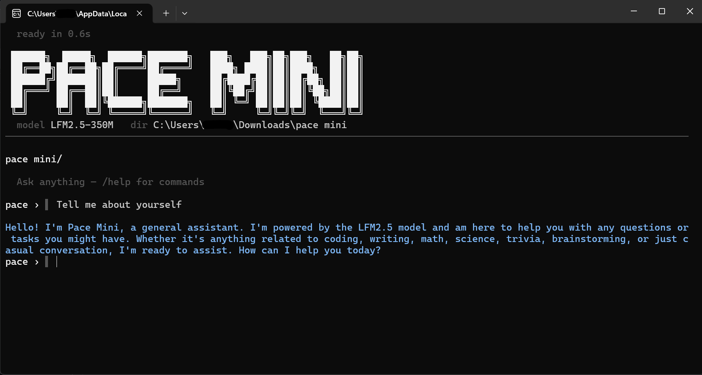

# Pace-Mini
Newest mini ultra-fast version of pace, the fastest local LLM. Super small at just 250mb at size and that includes the Ollama engine. Semi capable and is okay at instruction following. Can be used to write summaries of large files (books, code, huge documents) in under 1 second. Additionally, fairly good at math, science, english, code and trivia. Powered by `LFM2.5 350M` - a liquid foundation model allowing it to run extremely fast on absolutely terrible devices.
## Instructions
Super easy. Just download pace_mini.py and double click it on windows and everything should be done.   On mac, cd~/path and run `python3 pace_mini.py`
## Download
Via Github: [Pace Mini Download](https://github.com/Katsugachi/Pace-Mini/releases/download/downloads/pace_mini.py)
## Example

  

 
Pace Mini above: Responses after initially loading the model are basically instant. 
